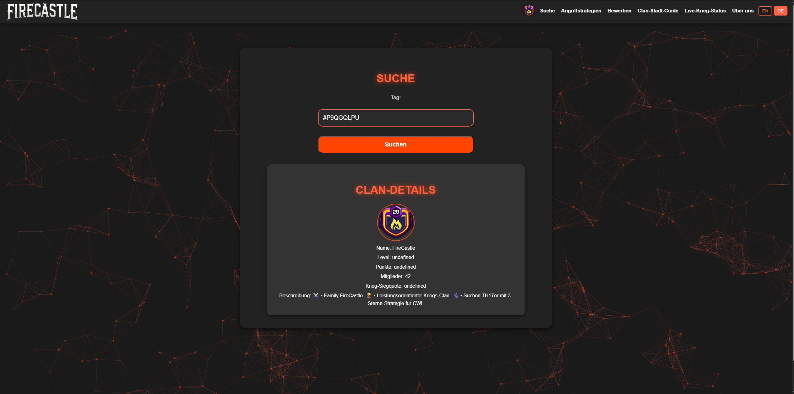
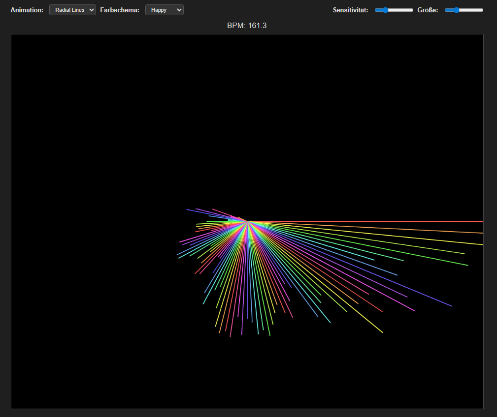
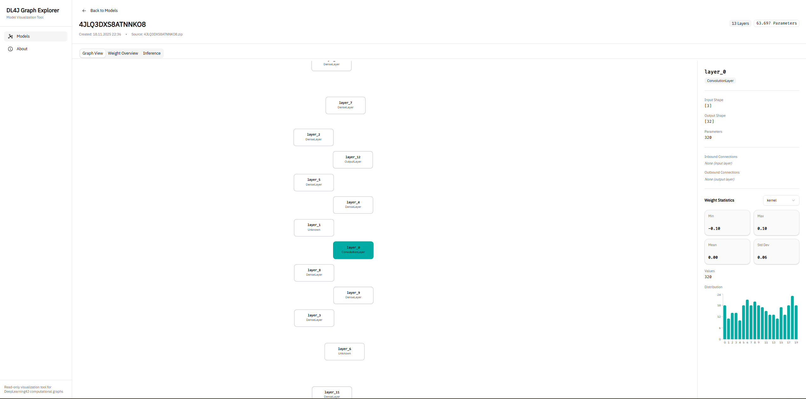

# Maximilian Haak - Portfolio

**🌐 Live Website:** [maximilianhaak.de](https://maximilianhaak.de)

Professional portfolio website showcasing interactive software development projects with automated CI/CD deployment to GitHub Pages.

---

## 🎮 Featured Projects

### AgeOfMax - Strategic Tower Defense Game

A strategic tower defense game spanning 5 historical epochs from the Stone Age to the Future. Build and upgrade units to defend your base!

- **Technologies:** TypeScript, Phaser 3, Vite
- **Features:** Multiple epochs, strategic gameplay, responsive controls
- **Play Now:** [maximilianhaak.de/AgeOfMax](https://maximilianhaak.de/AgeOfMax)
- **Repository:** [MaxeLBerger/AgeOfMax](https://github.com/MaxeLBerger/AgeOfMax)

---

### FireCastle - Clash of Clans Management

Comprehensive clan management website with real-time statistics, player profiles, and war information using the Clash of Clans API.

- **Technologies:** JavaScript, Node.js, Express, REST API
- **Features:** Live clan stats, player tracking, caching, logging
- **Visit:** [maximilianhaak.de/FireCastle](https://maximilianhaak.de/FireCastle)
- **Repository:** [MaxeLBerger/FireCastle](https://github.com/MaxeLBerger/FireCastle)

---

### AuTuneOnline - Audio Visualizer

Professional audio visualizer with real-time BPM detection, frequency analysis, and reactive particle effects. Upload your music and experience it visually!

- **Technologies:** JavaScript, Web Audio API, Canvas
- **Features:** BPM detection, frequency analysis, particle effects
- **Try It:** [maximilianhaak.de/AuTuneOnline](https://maximilianhaak.de/AuTuneOnline)
- **Repository:** [MaxeLBerger/AuTuneOnline](https://github.com/MaxeLBerger/AuTuneOnline)

---

### CasinoIdleSlots - Idle Casino Game

Idle slot machine casino game with GitHub integration. Collect coins, unlock upgrades, and climb the leaderboard!

- **Technologies:** TypeScript, Vite, Local Storage
- **Features:** Idle gameplay, upgrades, achievements, leaderboard
- **Play Now:** [maximilianhaak.de/CasinoIdleSlots](https://maximilianhaak.de/CasinoIdleSlots)
- **Repository:** [MaxeLBerger/casino-idle-slots](https://github.com/MaxeLBerger/casino-idle-slots)

---

### TestoMax - Modern Web Application

Innovative web project showcasing modern web technologies with interactive features and optimized performance.

- **Technologies:** HTML5, CSS3, JavaScript
- **Features:** Interactive UI, responsive design, modern architecture
- **View Project:** [maximilianhaak.de/TestoMax](https://maximilianhaak.de/TestoMax)
- **Repository:** [MaxeLBerger/TestoMax](https://github.com/MaxeLBerger/TestoMax)

---

### BetterBestie - 30-Day GlowUp Challenge

Full-stack wellness app for the 30-day GlowUp Challenge. Track daily tasks across hydration, movement, mindfulness, nutrition, learning, and sleep categories.

- **Technologies:** TypeScript, React 19, Express, Vite, JWT Auth
- **Features:** 150+ daily tasks, category tracking, mobile-first design, JWT authentication
- **Try It:** [maximilianhaak.de/BetterBestie](https://maximilianhaak.de/BetterBestie)
- **Repository:** [MaxeLBerger/BetterBestie](https://github.com/MaxeLBerger/BetterBestie)

---

### DL4J Graph Explorer - Neural Network Visualizer

Read-only visualization tool for DeepLearning4J computational graph models. Import trained models and explore their architecture visually with D3.js.

- **Technologies:** TypeScript, React, D3.js, Tailwind CSS, Radix UI
- **Features:** Layer topology visualization, weight statistics, local-first architecture
- **Try It:** [maximilianhaak.de/dl4j-graph-explorer](https://maximilianhaak.de/dl4j-graph-explorer)
- **Repository:** [MaxeLBerger/dl4j-graph-explorer](https://github.com/MaxeLBerger/dl4j-graph-explorer)

---

## 🛠️ Technologies

**Frontend:** HTML5, CSS3, JavaScript, TypeScript  
**Frameworks:** Phaser 3, Node.js, Express  
**Build Tools:** Vite, npm  
**CI/CD:** GitHub Actions  
**Hosting:** GitHub Pages  
**Version Control:** Git with Submodules

---

## 🚀 Automated Deployment

This portfolio uses a fully automated CI/CD pipeline. Every push to any project repository automatically:

1. Triggers a workflow in the main portfolio repository
2. Updates the project submodule to the latest commit
3. Builds all TypeScript/Vite projects
4. Deploys the complete site to GitHub Pages

**Result:** Code changes go live in ~3 minutes! 🚀

---

## � Getting Started

1. **Understand the system** - Read [AUTOMATION_OVERVIEW.md](AUTOMATION_OVERVIEW.md)
2. **Set up automation** - Follow [COMPLETE_SETUP_GUIDE.md](COMPLETE_SETUP_GUIDE.md)
3. **Daily reference** - Use [QUICK_REFERENCE.md](QUICK_REFERENCE.md) for commands

After setup: Push to any project repo → Automatic portfolio update → Live in 3-5 minutes!

---

## 📖 Documentation

| Document | Purpose |
|----------|---------|
| [AUTOMATION_OVERVIEW.md](AUTOMATION_OVERVIEW.md) | System overview and architecture |
| [COMPLETE_SETUP_GUIDE.md](COMPLETE_SETUP_GUIDE.md) | Step-by-step setup instructions |
| [PROJECT_TEMPLATES.md](PROJECT_TEMPLATES.md) | Copy-paste workflow templates |
| [WORKFLOW_GUIDE.md](WORKFLOW_GUIDE.md) | Deployment workflow details |
| [TESTING.md](TESTING.md) | Testing documentation |
| [QUICK_REFERENCE.md](QUICK_REFERENCE.md) | Commands and troubleshooting |
| [CONTRIBUTING.md](CONTRIBUTING.md) | Contribution guidelines |

---

## 📬 Contact

**Maximilian Haak**  
🌐 [maximilianhaak.de](https://maximilianhaak.de)  
💼 [GitHub](https://github.com/MaxeLBerger)

---

## 📄 License

Individual projects have their own licenses. See submodule repositories for details.

---

**Built with ❤️ by Maximilian Haak**
